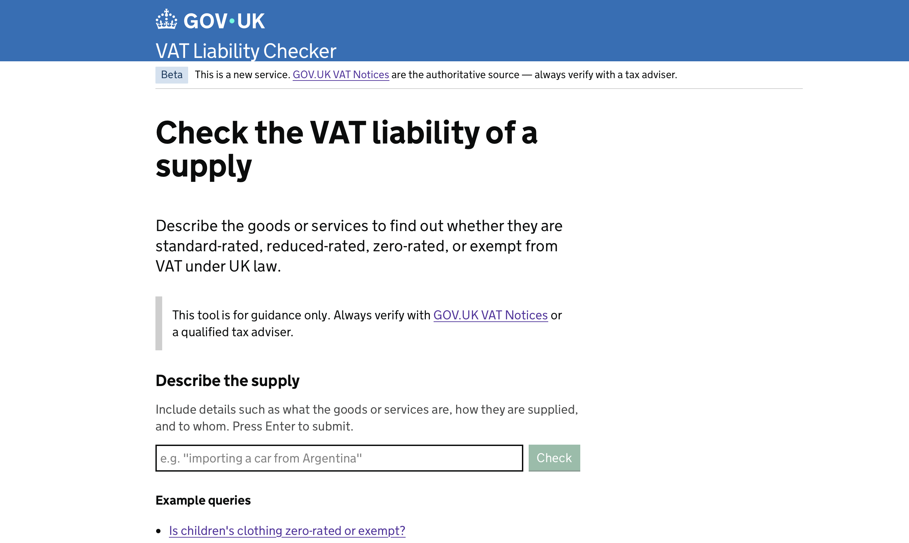
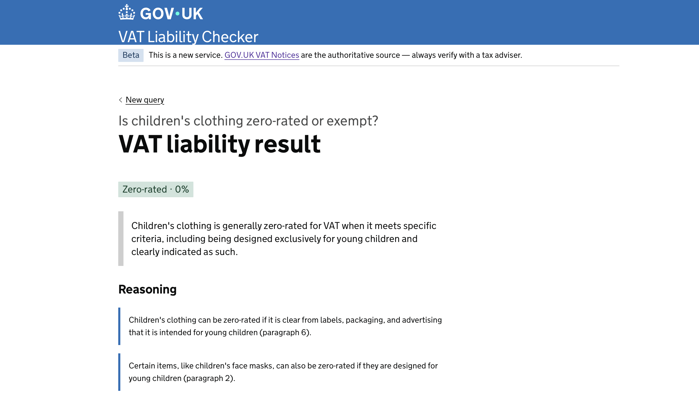

# FindVAT

> **Disclaimer:** FindVAT is a personal research aid and is not a substitute for professional tax advice. Answers are AI-generated and, while evidence-based and cited, may be incomplete or incorrect. Always verify outputs against the official [HMRC VAT Notices](https://www.gov.uk/government/collections/vat-notices-numerical-order) or consult a qualified tax adviser before making any decisions.

**FindVAT** is a VAT liability tool that uses an LLM to determine the UK VAT treatment of a supply. Enter a supply (a product, service, or transaction) and the app returns its UK VAT liability (standard-rated, reduced-rated, zero-rated, or exempt), backed by citations from the relevant HMRC VAT Notice.

Built by an HMRC compliance caseworker in the VAT regime, FindVAT uses a multi-step prompting pipeline to efficiently narrow down all 109 VAT Notices in a cost-effective, evidence-based manner, drawing on the GOV.UK Content API for source data.

**[Try the live demo](https://vat-liability-checker-git-gds-ec20468s-projects.vercel.app)**





---

## How It Works

VAT liability in the UK is governed by 109 HMRC VAT Notices. Querying all of them in a single prompt would be expensive and slow. FindVAT solves this with a structured pipeline:

1. **Classify**: The supply is classified into generic supply-type descriptions that map to notice titles.
2. **Select**: Keyword scoring + a model call narrows the full index down to the minimum relevant notices (typically 1–5).
3. **Fetch**: The relevant notices are fetched live from the GOV.UK Content API and their paragraphs are scored for relevance.
4. **Analyse**: The model works through a fixed audit sequence (candidate relief, exclusion search, conflict check, default rate comparison), grounding each step in a citation before it either returns a liability conclusion or identifies a blocking condition it cannot resolve.
5. **Clarify**: If a blocking condition exists, the model generates a single factual question (e.g. _"Is it sold above room temperature?"_) to resolve it. This repeats up to twice.
6. **Answer**: A final conclusion is returned with VAT rate, reasoning bullets, and paragraph-level citations linking back to GOV.UK.

---

## Tech Stack

| Layer           | Technology                                                           |
| --------------- | -------------------------------------------------------------------- |
| Framework       | [Next.js](https://nextjs.org/) 14 (App Router)                       |
| Styling         | [Tailwind CSS](https://tailwindcss.com/) v4                          |
| UI              | [GOV.UK Design System](https://design-system.service.gov.uk/) (govuk-frontend) |
| Theming         | [next-themes](https://github.com/pacocoursey/next-themes)            |
| AI              | [Vercel AI SDK](https://sdk.vercel.ai/) (model-agnostic)             |
| Data            | [GOV.UK Content API](https://content-api.publishing.service.gov.uk/) |
| Animations      | [Motion](https://motion.dev/) + [Three.js](https://threejs.org/)     |
| Validation      | [Zod](https://zod.dev/)                                              |
| Package Manager | [pnpm](https://pnpm.io/)                                             |

---

## Getting Started

### Prerequisites

- [Node.js](https://nodejs.org/) v18+
- [pnpm](https://pnpm.io/) v10+
- An AI Gateway API key

### Installation

1. **Clone the repository**

```bash
git clone https://github.com/ec20468/VAT-Liability-Checker.git
cd VAT-Liability-Checker
```

2. **Install dependencies**

```bash
pnpm install
```

3. **Set up environment variables**

Copy the example env file and fill in your values:

```bash
cp .env.example .env
```

```env
AI_GATEWAY_API_KEY=your_api_key_here
```

4. **Start the development server**

```bash
pnpm dev
```

Open [http://localhost:3000](http://localhost:3000) in your browser.

---

## Project Structure

```
findvat/
├── app/
│   ├── api/flow/         # Multi-step VAT pipeline (streaming NDJSON)
│   ├── layout.tsx
│   └── page.tsx
├── components/
│   ├── ui/               # Generic UI components
│   └── vat/              # VAT flow screens (Initial, Clarifier, Answer, Loading)
├── lib/
│   ├── govuk/            # GOV.UK Content API client and VAT Notice index
│   └── schemas/          # Zod schemas for pipeline data shapes
└── scripts/              # Utility scripts
```

---

## Author

Built by Ahmed, HMRC compliance caseworker and software developer.  
[GitHub](https://github.com/ec20468) · [LinkedIn](https://www.linkedin.com/in/ahmedahassan1)
